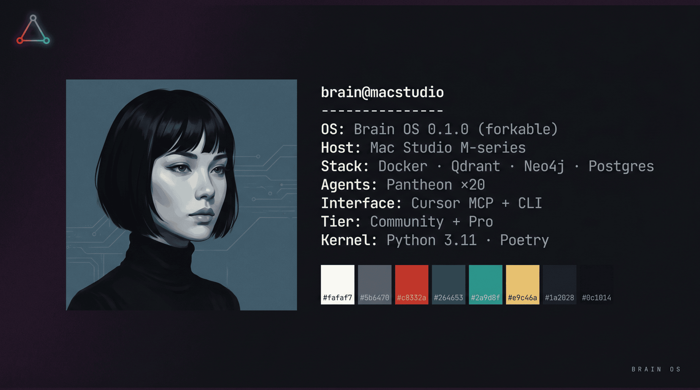

<p align="center">
  <a href="https://github.com/doshirush1901/brain-os">
    
  </a>
</p>

<p align="center">
  <a href="https://github.com/doshirush1901/brain-os/actions/workflows/ci.yml"></a>
  <a href="https://www.python.org/downloads/"></a>
  <a href="LICENSE"></a>
  <a href="docs/LICENSING.md"></a>
  <a href="docs/MCP_SETUP.md"></a>
</p>

<p align="center">
  <a href="docs/QUICKSTART.md"><strong>Quickstart</strong></a>
  &nbsp;&middot;&nbsp;
  <a href="docs/MCP_SETUP.md"><strong>MCP setup</strong></a>
  &nbsp;&middot;&nbsp;
  <a href="examples/acme/journey.md"><strong>Acme demo</strong></a>
  &nbsp;&middot;&nbsp;
  <a href="docs/FORK_GUIDE.md"><strong>Fork guide</strong></a>
  &nbsp;&middot;&nbsp;
  <a href="docs/LICENSING.md"><strong>Licensing</strong></a>
</p>

<br>

<table>
<tr>
<td width="33%" valign="top">

### Pipeline

17-step agent runtime with routing, grounding, corrections, and voice shaping — not a thin chat wrapper.

</td>
<td width="33%" valign="top">

### Pantheon

20 starter agents (Athena, Clio, Calliope, …). Extend via `docs/PANTHEON_SLIM_TODO.md`.

</td>
<td width="33%" valign="top">

### Evidence-first

Triangulation before outbound: KB, CRM, mail scope, proof registry. See `docs/IRA_TRIANGULATION.md`.

</td>
</tr>
</table>

<br>

> [!NOTE]
> **[Ira](https://github.com/doshirush1901/ira-v3)** is Machinecraft's *private* operator stack (live CRM, Gmail, production).
> **Brain OS** is the *public fork* — same engine patterns, **[Acme](examples/acme/)** synthetic data only.
> Clone → private fork → your `.env` and data never ship in this repo.

---

## Architecture

```
  Cursor / Claude MCP          CLI (brain ask)
           \                         /
            v                       v
         +--------------------------------+
         |   Pantheon  +  17-step pipeline |
         +----------------+----------------+
                          |
            +-------------+-------------+
            v             v             v
        Qdrant        Neo4j         Postgres
        (vectors)     (graph)       (CRM)
```

---

## Get started

See **[docs/QUICKSTART.md](docs/QUICKSTART.md)** for the full walkthrough.

```bash
git clone https://github.com/doshirush1901/brain-os.git
cd brain-os
cp .env.example .env    # OPENAI_API_KEY, optional VOYAGE_API_KEY
./scripts/macpro/bootstrap.sh
poetry run brain health
poetry run brain activate --trial
poetry run brain seed-acme
poetry run brain ask "Summarize the Acme demo CRM" --json
```

| Step | Command |
|:-----|:--------|
| MCP in Cursor | `cp .cursor/mcp.json.example .cursor/mcp.json` then enable in **Settings → MCP** |
| MCP smoke test | `poetry run brain mcp` |
| Full MCP guide | [docs/MCP_SETUP.md](docs/MCP_SETUP.md) |

---

## What's included

| Area | Path |
|:-----|:-----|
| Demo company | [examples/acme/](examples/acme/) |
| Operator journey | [examples/acme/journey.md](examples/acme/journey.md) |
| Mac bootstrap | [scripts/macpro/bootstrap.sh](scripts/macpro/bootstrap.sh) |
| Starter agents | [src/brain_os/pantheon.py](src/brain_os/pantheon.py) |

---

## Licensing

| Tier | Highlights |
|:-----|:-----------|
| **Community** | Free fork · 500 doc cap · ~26 MCP tools · draft-only email |
| **Pro / trial** | `brain activate --trial` (14 days) or license key · full MCP |

[docs/LICENSING.md](docs/LICENSING.md) · [BSL counsel brief](docs/BRAIN_OS_BSL_COUNSEL_BRIEF.md)

---

## Documentation

| Doc | Description |
|:----|:------------|
| [Quickstart](docs/QUICKSTART.md) | Clone → bootstrap → first `brain ask` |
| [Fork guide](docs/FORK_GUIDE.md) | Private fork checklist (7 days → month 1) |
| [MCP setup](docs/MCP_SETUP.md) | Cursor, Claude Code, Claude Desktop |
| [Product roadmap](docs/BRAIN_OS_PRODUCTIZATION_ROADMAP.md) | Architecture and GTM |
| [Brand assets](docs/BRAND.md) | Logo, README hero, social preview |
| [Changelog](CHANGELOG.md) | Release notes |
| [Contributing](CONTRIBUTING.md) | PR guidelines · [Code of conduct](CODE_OF_CONDUCT.md) |
| [Security](SECURITY.md) | Reporting issues |

**Also:** [ira-universe](https://github.com/doshirush1901/ira-universe) (visitor-safe Ira explainer) · [ira-v3](https://github.com/doshirush1901/ira-v3) (private operator reference)

---

<p align="center">
  
  <br>
  <sub>Built from <a href="https://github.com/doshirush1901/ira-v3">Ira v3</a> · Maintained via <code>export_brain_os.py</code> in the private tree</sub>
</p>
