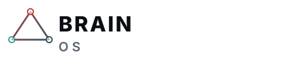
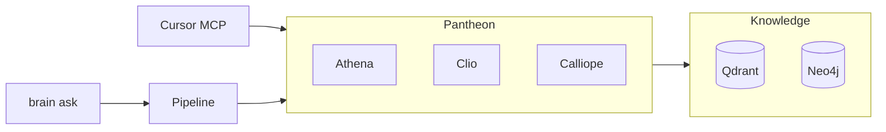

<p align="center">
  
</p>

<h1 align="center">Brain OS</h1>

<p align="center">
  <strong>Forkable local-first multi-agent operating system for Mac.</strong><br>
  Vector + graph + memory RAG · CRM · human-in-the-loop outbound · Cursor MCP
</p>

<p align="center">
  <a href="https://github.com/doshirush1901/brain-os"></a>
  <a href="LICENSE"></a>
  <a href="docs/LICENSING.md"></a>
</p>

<p align="center">
  
</p>

---

> **Ira** is Machinecraft's <em>private</em> operator brain (live CRM, Gmail, production truth).
> **Brain OS** is the <strong>public fork</strong> — same architecture patterns, synthetic <a href="examples/acme/journey.md">Acme</a> demo only.
> Run your company in a <strong>private fork</strong>; no Machinecraft customer data ships here.

## Why Brain OS

| | |
|:--|:--|
| **Not** | A chatbot starter or generic LangChain demo |
| **Is** | A 17-step agent pipeline, starter pantheon (20 agents), triangulation briefs, corrections, operator inbox patterns — packaged for Mac Pro / Cursor |



## Quickstart

```bash
git clone https://github.com/doshirush1901/brain-os.git && cd brain-os
cp .env.example .env          # OPENAI_API_KEY, optional VOYAGE_API_KEY
./scripts/macpro/bootstrap.sh
poetry run brain health
poetry run brain activate --trial   # 14-day Pro
poetry run brain seed-acme
```

```bash
poetry run brain ask "What does the Acme demo pack contain?" --json
poetry run brain-mcp              # Cursor: see .mcp.json.example
```

## Demo pack

| Path | Contents |
|:-----|:---------|
| [examples/acme/](examples/acme/) | SOUL, CRM seed, proof registry, journey |
| [examples/acme/journey.md](examples/acme/journey.md) | Operator walkthrough |

## Licensing

| Tier | Docs |
|:-----|:-----|
| **Community** | 500 doc cap · ~26 MCP tools · draft-only email |
| **Pro / trial** | `brain activate --trial` or license key |

See [docs/LICENSING.md](docs/LICENSING.md) · [LICENSE](LICENSE) (BSL 1.1 — [counsel brief](docs/BRAIN_OS_BSL_COUNSEL_BRIEF.md))

## Docs

| Document | Topic |
|:---------|:------|
| [docs/BRAIN_OS_PRODUCTIZATION_ROADMAP.md](docs/BRAIN_OS_PRODUCTIZATION_ROADMAP.md) | Product architecture |
| [docs/BRAND.md](docs/BRAND.md) | Logo, colors, social preview |
| [docs/IRA_TRIANGULATION.md](docs/IRA_TRIANGULATION.md) | Evidence-before-action |
| [docs/PANTHEON_SLIM_TODO.md](docs/PANTHEON_SLIM_TODO.md) | Add custom agents |

## Related repos

| Repo | Role |
|:-----|:-----|
| **brain-os** (this) | Fork and customize |
| [ira-v3](https://github.com/doshirush1901/ira-v3) | Machinecraft private operator |
| [ira-universe](https://github.com/doshirush1901/ira-universe) | Visitor-safe Ira explainer |

## Brand assets

Upload [docs/assets/social-preview.svg](docs/assets/social-preview.svg) (export to PNG 1280×640) in GitHub **Settings → Social preview** for a polished card on shares.

---

<p align="center"><sub>Extracted from Ira v3 · Maintained via <code>scripts/export_brain_os.py</code> in the private tree</sub></p>
